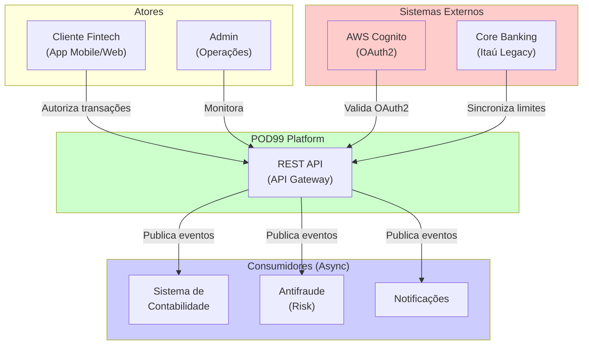
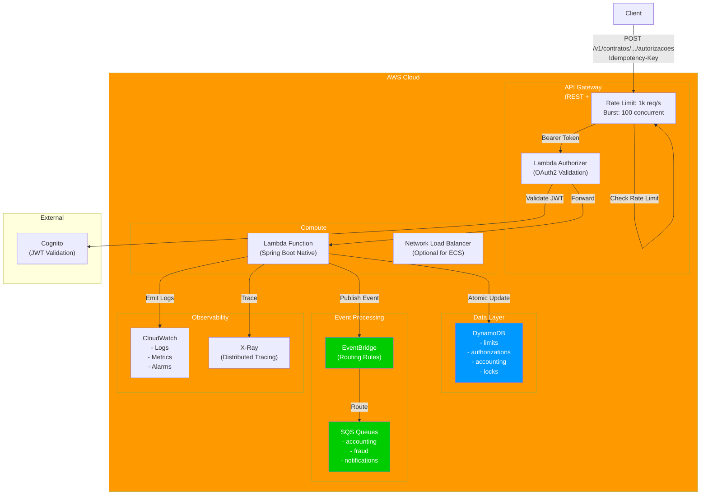
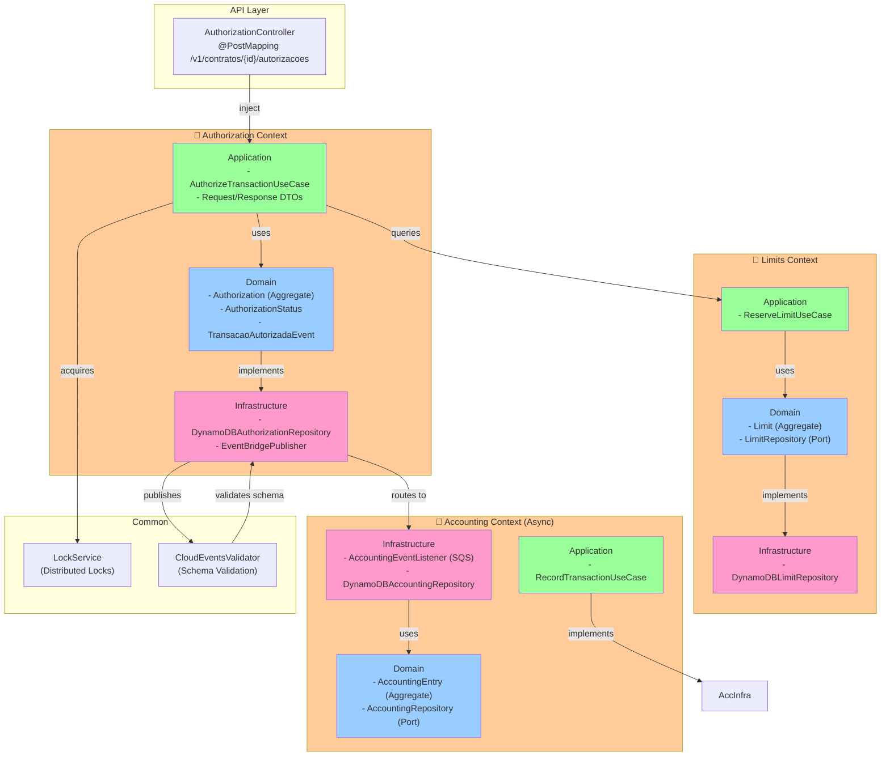
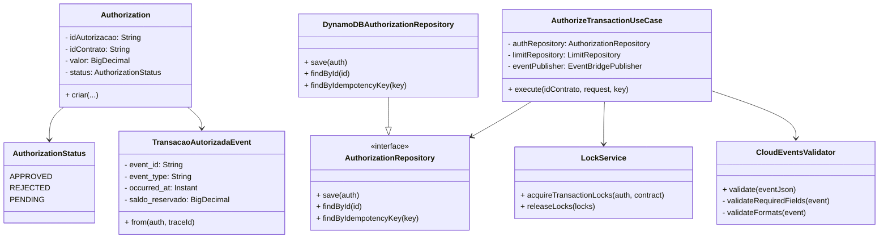
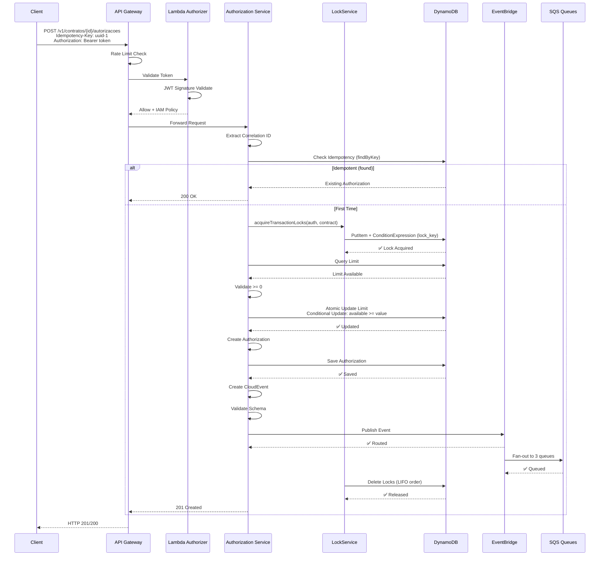
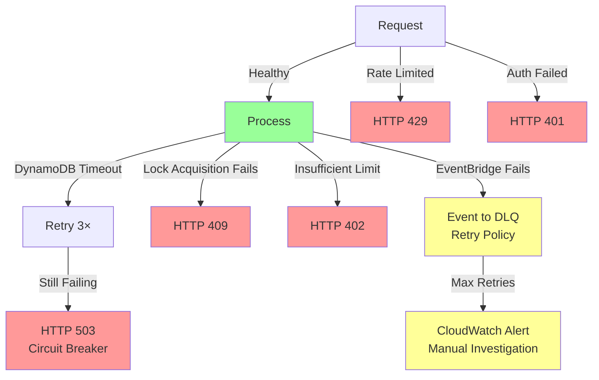

# POD99 — Arquitetura C4

Visualização em 4 níveis da arquitetura de sistema.

---

## Level 1: System Context



---

## Level 2: Container



---

## Level 3: Component (Bounded Contexts)



---

## Level 4: Code (Class Diagram - Authorization Context)



---

## Fluxo de Autorização (Sequência)



---

## Arquitetura de Persistência (Database-per-Context)

```
POD99 Platform
│
├─ Authorization Context
│  └─ pod99-authorizations (DynamoDB)
│     ├─ PK: id_autorizacao (String)
│     ├─ GSI: id_contrato (for queries by contract)
│     ├─ TTL: expiry_time (7 days)
│     └─ Replication: Multi-region optional
│
├─ Limits Context
│  └─ pod99-limits (DynamoDB)
│     ├─ PK: id_contrato (String)
│     ├─ Attributes: limite, disponivel, reservado, version
│     └─ Optimistic Locking: version field
│
├─ Accounting Context (Async)
│  └─ pod99-accounting (DynamoDB)
│     ├─ PK: event_id (String)
│     ├─ GSI: id_autorizacao (for queries)
│     ├─ TTL: expiry_time (30 days for audit)
│     └─ Immutable: records never updated
│
└─ Infrastructure
   └─ pod99-locks (DynamoDB)
      ├─ PK: lock_key (String)
      ├─ TTL: expiry_time (30 seconds, auto cleanup)
      └─ Transient: data not persisted long-term
```

---

## Escalabilidade: Throughput by Layer

```
5.000 TPS (Target)
│
├─ API Gateway
│  ├─ Rate Limit: 1.000 req/s (configurable)
│  ├─ Burst: 100 concurrent
│  └─ Exceeds? → HTTP 429 Too Many Requests
│
├─ Authorization Service (Compute)
│  ├─ Lambda: 1.000 reserved concurrency
│  ├─ ECS Fargate: 100 tasks × 50 TPS = 5.000 TPS
│  └─ Scale strategy: Target tracking (70% CPU)
│
├─ DynamoDB (Data Layer)
│  ├─ Billing Mode: PAY_PER_REQUEST (auto-scale)
│  ├─ Partition Key: id_contrato (avoid hotspot)
│  ├─ Write Capacity: ~15.000 WCU/s (5k × 3 operations)
│  └─ Scaling: Automatic (milliseconds to scale)
│
└─ EventBridge + SQS (Events)
   ├─ EventBridge: Unlimited
   ├─ SQS: 300.000 messages/s per queue
   └─ Consumers: Auto-scale pollers
```

---

## Resiliência & Fallback


